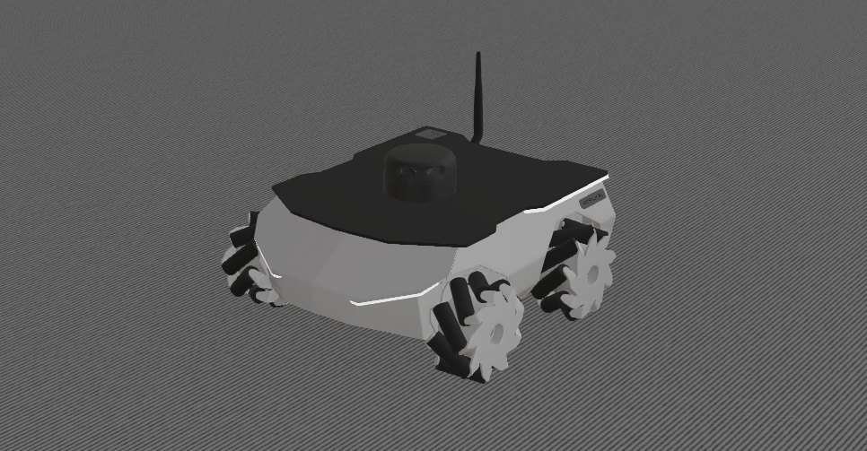

# webots-docker
[](https://github.com/husarion/webots-docker/actions/workflows/build-docker-image.yaml)

Dockerized ROSbot 2R and ROSbot XL simulation in webots built for ROS2 Galactic distro.


# Docker image usage
Available tags: `galactic`.
## Pulling docker image
```bash
docker pull husarion/webots
```
## Running docker image
```bash
docker run --rm -it \
-v /tmp/.X11-unix:/tmp/.X11-unix:rw \
-e DISPLAY -e LIBGL_ALWAYS_SOFTWARE=1 \
-e DDS_CONFIG=DEFAULT -e RMW_IMPLEMENTATION=rmw_fastrtps_cpp \
husarion/webots:galactic \
ros2 launch webots_ros2_husarion robot_launch.py
```

If you want to use ROSbot XL add a `robot_name` parameter to the launch command.
```bash
docker run --rm -it \
-v /tmp/.X11-unix:/tmp/.X11-unix:rw \
-e DISPLAY -e LIBGL_ALWAYS_SOFTWARE=1 \
-e DDS_CONFIG=DEFAULT -e RMW_IMPLEMENTATION=rmw_fastrtps_cpp \
husarion/webots:galactic \
ros2 launch webots_ros2_husarion robot_launch.py robot_name:="rosbot_xl"
```


## Running demo with `docker compose`
Go to [demo/](demo/) folder and read [demo/README.md](demo/README.md).
