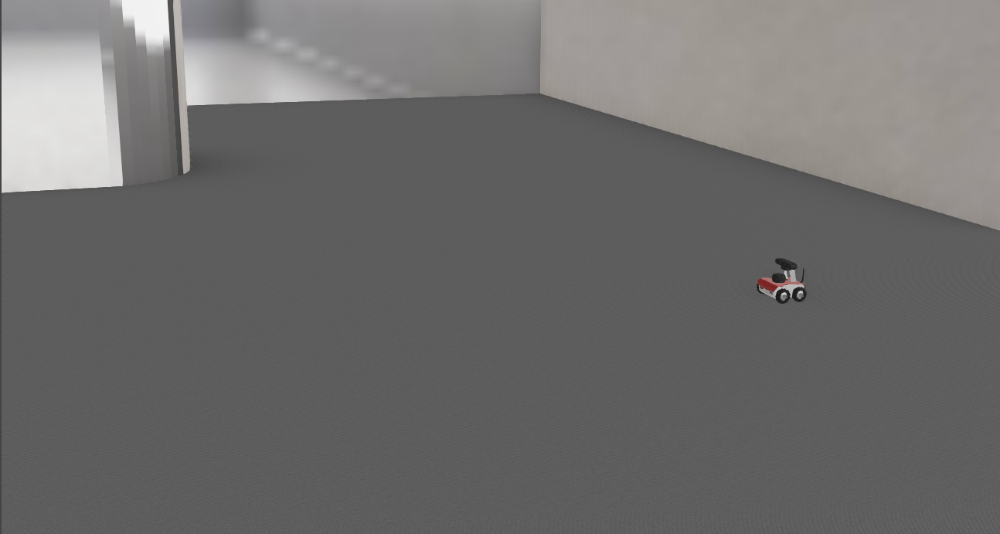
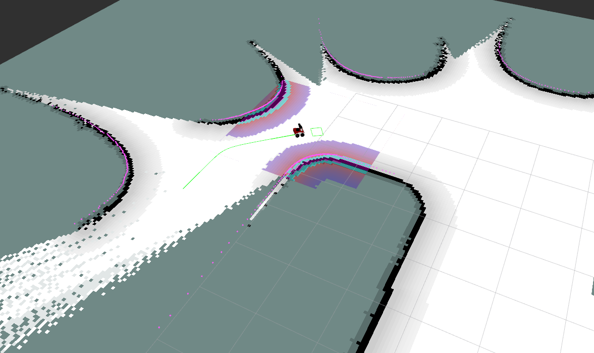

# webots-docker
[](https://github.com/husarion/webots-docker/actions/workflows/build-docker-image.yaml)

Dockerized ROSbot simulation in webots built for ROS2 Galactic distro.


# Docker image usage
Available tags: `galactic`.
## Pulling docker image
```bash
docker pull husarion/webots
```
## Running docker image
```bash
docker run --rm -it \
-v /tmp/.X11-unix:/tmp/.X11-unix:rw \
-e DISPLAY -e LIBGL_ALWAYS_SOFTWARE=1 \
-e DDS_CONFIG=DEFAULT -e RMW_IMPLEMENTATION=rmw_fastrtps_cpp \
husarion/webots:galactic \
ros2 launch webots_ros2_husarion robot_launch.py
```

# ROSbot webots mapping and navigation demo
Check it out in [demo/](demo/]) folder.

