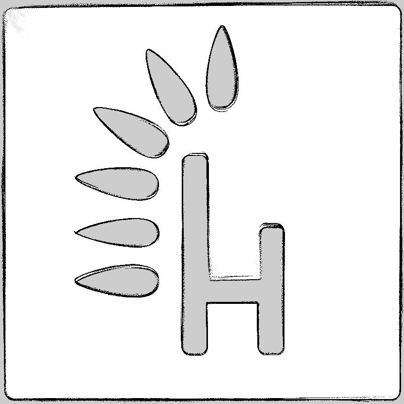

## Run with `docker compose`
To start simulation build and run webots simulator container. It will take a while because the container has to download required assets:
```bash
docker compose -f compose.rosbot.webots.yaml up --build
```

Wait until this messages show up in the Webots console.
> INFO: 'rosbot' extern controller: connected.
>
> INFO: 'Ros2Supervisor' extern controller: connected.

Then run rviz2 to navigate the ROSBot:
```bash
docker compose -f compose.rviz.yaml up
```

# Mapping case
> **Warning**
> The [use_scan_matching](https://github.com/husarion/webots-docker/blob/dev/demo/config/slam_params.yaml#L31) parameter is not used due to bugged map building.

Open new terminal and run navigation2 with slam-toolbox and map-saver:
```bash
docker compose -f compose.rosbot.mapping.yaml up
```

Demo is launched. Now go to rviz2 choose option `Nav2 Goal` and select a goal position for ROSbot.

# Navigation case
If you don't want to map on your own copy files from `built_map` to `maps` folder:
```bash
cp built_map/map.yaml maps/
cp built_map/map.png maps/
```


Open new terminal and run navigation2 with amcl:
```bash
docker compose -f compose.rosbot.navigation.yaml up
```

Demo is launched. Go to rviz2 choose option `2D Pose Estimate` and select initial position of ROSbot.
Now you can click on the `Nav2 Goal` button and select a goal position for ROSbot.